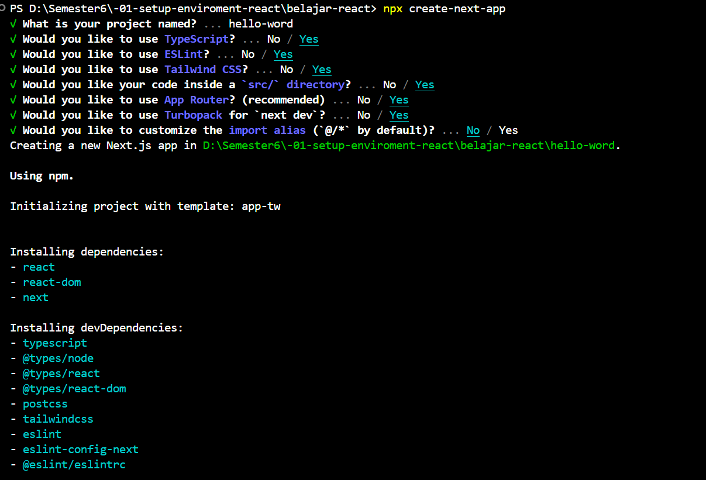
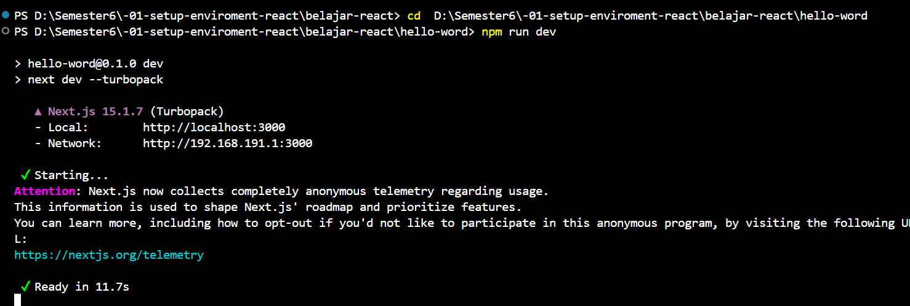

Praktikum 2 :

Pada Langkah ke-2, setelah membuat proyek baru menggunakan Next.js, terdapat beberapa 
istilah yang muncul. Jelaskan istilah tersebut, TypeScript, ESLint, Tailwind CSS, App 
Router, Import alias, App router, dan Turbopack!
1. TypeScript : Superset dari JavaScript yang menambahkan tipe data statis untuk meningkatkan keandalan kode.  
2. ESLint : Alat linter yang membantu mendeteksi dan memperbaiki kesalahan dalam kode JavaScript/TypeScript.  
3. Tailwind CSS : Framework CSS berbasis utility-first yang memungkinkan styling cepat dengan class langsung di HTML/JSX.  
4. App Router : Sistem routing terbaru di Next.js yang menggunakan pendekatan berbasis folder (`app/`) untuk struktur lebih modular.  
5. Import Alias : Fitur yang memungkinkan penggunaan path pendek untuk menghindari import relatif yang panjang.  
6. Turbopack : Bundler baru yang dikembangkan oleh Vercel sebagai penerus Webpack, lebih cepat dalam proses build dan hot reloading.

Apa saja kegunaak folder dan file yang ada pada struktur proyek React yang tampil pada 
gambar pada tahap percobaan ke-3! 
1. page.tsx : Halaman utama aplikasi.  
2. layout.tsx : Mengatur layout global untuk seluruh halaman.  
3. globals.css : File CSS global untuk styling.  
4. package.json : Menyimpan daftar dependensi dan skrip proyek.  
5. tsconfig.json : Konfigurasi TypeScript.  
6. next.config.ts : Konfigurasi Next.js.  
7. .gitignore : Menentukan file yang tidak dilacak oleh Git.  
        File lainnya lebih bersifat tambahan atau otomatis dibuat oleh Next.js.

Buktikan dengan screenshoot yang menunjukkan bahwa tahapan percobaan di atas telah 
berhasil Anda lakukan!
    -- hello-word
 -- cd-hello-word
       -- Next-js