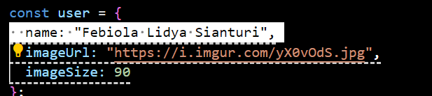
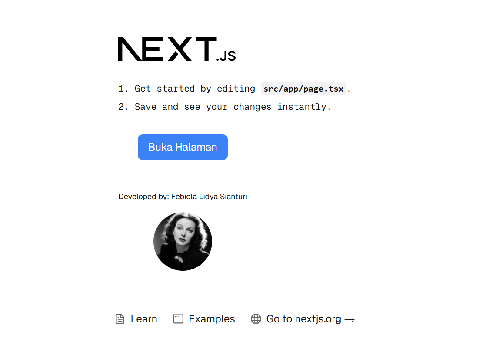

Praktikum 4 :

Untuk apakah kegunaan sintaks user.imageUrl? 
Sintaks user.imageUrl digunakan untuk mengambil nilai dari properti imageUrl dalam objek user. Dalam kode yang kamu buat, objek user menyimpan informasi tentang pengguna, termasuk nama, URL gambar profil, dan ukuran gambar.

1. Hasil pertama 
2. Hasil Next.js 