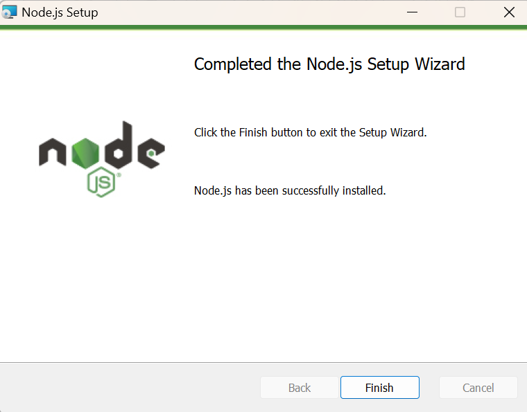
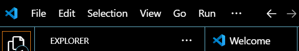

<!-- 
Nama  : Febiola Lidya Sianturi
Kelas : 3D
Nim   : 2241720229
-->

Praktikum 1 :

Jelaskan kegunaan masing-masing dari Git, VS Code dan NodeJS yang telah Anda install 
pada sesi praktikum ini! 
1. Github  =  Platform berbasis cloud untuk menyimpan dan mengelola kode dengan Git, memfasilitasi kolaborasi dan versi kontrol.
2. Nodejs  = Runtime JavaScript yang memungkinkan eksekusi JavaScript di luar browser, sering digunakan untuk pengembangan backend.
3. VS Code = Code editor ringan dengan fitur debugging, terminal terintegrasi, dan ekstensi untuk berbagai bahasa pemrograman.

Buktikan dengan screenshoot yang menunjukkan bahwa masing-masing tools tersebut 
telah berhasil terinstall di perangkat Anda! 
1.     -- Github
2.  -- Nodejs
3.  -- Visual Studio Code